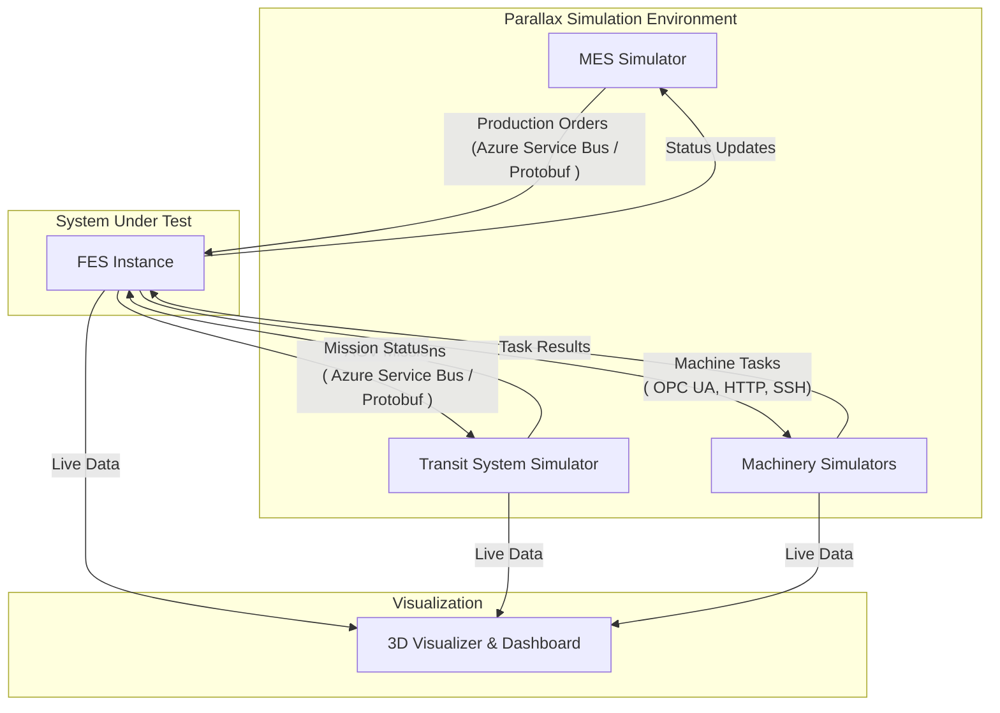

```mermaid
graph TD
    subgraph Parallax Simulation Environment
        direction LR
        MES_Sim[MES Simulator]
        Transit_Sim[Transit System Simulator]
        Machine_Sim[Machinery Simulators]
    end

    subgraph System Under Test
        FES[FES Instance]
    end

    subgraph Visualization
        Bevy[3D Visualizer & Dashboard]
    end

    MES_Sim -- Production Orders <br/> (Azure Service Bus / Protobuf ) --> FES
FES -- Status Updates --> MES_Sim

FES -- AGV Missions <br/> ( Azure Service Bus / Protobuf ) --> Transit_Sim
Transit_Sim -- Mission Status --> FES

FES -- Machine Tasks <br/> ( OPC UA, HTTP, SSH) --> Machine_Sim
Machine_Sim -- Task Results --> FES

FES -- Live Data --> Bevy
Transit_Sim -- Live Data --> Bevy
Machine_Sim -- Live Data --> Bevy
```